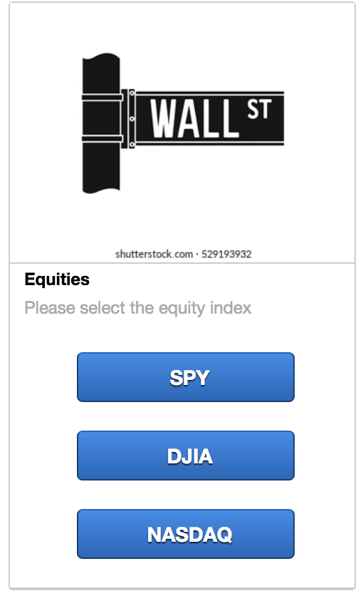
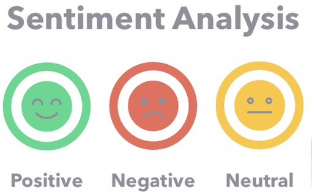
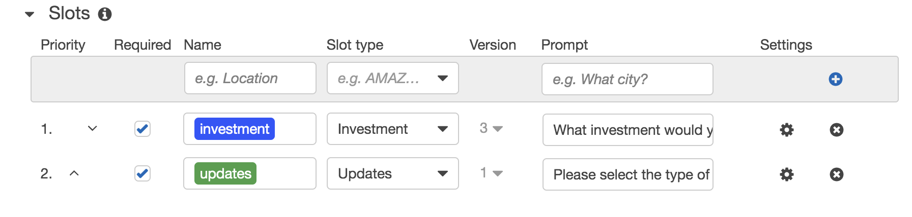
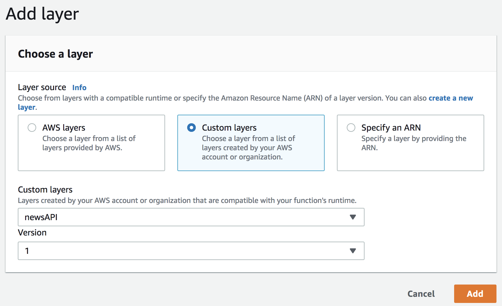

# Project 2 - Lex Luther Chat Box

# Team 4
##### 
---

## Intro 
The focus of this project was to create an automated chat box that returned the top headlines, price data & sentiment analysis for various asset classes. We wanted to create a tool that would provide a quick and efficient update for its user. 

## Data Preperation & Amazon Lex
 * We gave the user a selection of investment and economic data to choose from:
    1. Equities
    2. Fixed Income
    3. Cryptocurrencies
    4. Commodities
    5. Foreign Exchange
    6. Economic Data

## Natural Language Processing: VADER Sentiment
* Speed-performance advantage
* Less resource-consuming model
* No need for training data
* Only a few lines of code
* F1-Score of 0.96* 

_*https://blog.quantinsti.com/vader-sentiment/_ 

## AWS Lamda: Intent Handler & NLP Model
* Build
* Define
* Import
* Evaluate
* Return

## Final Conclusions & Challenges

* Additional library dependencies required
    * AWS Lambda Layers 
    * Cloud 9
* AWS Lambda Layers has a capacity limit of  250 MB
* Testing functions in AWS is inefficient

## Next Steps
* Import more libraries with AWS S3 
* Connect chat box to Slack, Twilio, Facebook, URL Website
* Add machine learning price/trend prediction

