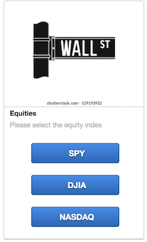
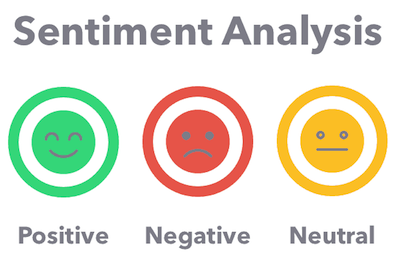

# Project 2 - Lex Luther Chat Box

# Team 4
##### 
---

## Intro 
The main focus of this project was to create an automated chat box that returned the top headlines, price data & sentiment analysis for various asset classes. We wanted to create a tool that would provide a quick and efficient update for its user. 

## Data Preperation & Amazon Lex
We used various API's to pull in all this data. We mainly used NewsAPI, Alternative Crypto, Alpaca & Quandl APIs for our equities, and other metrics, which we incorperated into a Jupyter Lab Notbook. We pulled our Econnomic data from FRED using QUANDL's python API. Unfortunately, due to AWS Lambda Layer limits of 250MB capacity we were unable to import all the libraries necessary to sync it with our Amazon Lex. As a work around, we pulled data from Alternative Crypto URL to demonstrate how fetching price would work. 

 * We gave the user a selection of investment and economic data to choose from:
    1. Equities
    2. Fixed Income
    3. Cryptocurrencies
    4. Commodities
    5. Foreign Exchange
    6. Economic Data

## Natural Language Processing: VADER Sentiment
In a data-driven world, sentinment analysis is extremly useful as it allows a wider public opinion about certain topics. Sentiment analysis is the process of computing and categorizing text into their respective polarity: postitive, negative or neutral.

A VADER sentiment analysis was a great way for our team to analyize the content of our data, it is:
* Speed-performance advantage
* Less resource-consuming model
* No need for training data
* Only a few lines of code
* F1-Score of 0.96* 

_*https://blog.quantinsti.com/vader-sentiment/_ 

## AWS Lambda: Intent Handler & NLP Model
The main code of our project consisted of building a Lambda Function that would handle the user requests from Amazon Lex. The user would select the Investment and Update they wanted, which would then get passed through our Lamda Function as a slot prompt and return a message with the final result. 

* Build AWS Lamda Function
* Import Libraries (Pandas, nltk, SentimentIntensityAnalyzer)
* Define functions including Main Handler, Intent Dispatcher, Data Validation, Get_Updates  
* Evaluate the headlines with VADER Sentiment Analyses
* Return Final Message to User

## Final Conclusions & Challenges
Finally, we did run into some problems that were an obstacle for us to be able to move into other steps of our project, mostly working with AWS. Some of the those were:

* Additional library dependencies required the use of ziped files utilizing:
    * AWS Lambda Layers 
    * Cloud 9 
* AWS Lambda Layers also had a capacity limit of  250 MB, which did not allow us to use other libraries such as Alpaca  or Quandl.
* Testing functions in AWS was very inefficient time consuming

## Next Steps
This project definitely has various implementations in our every day lives such as:
* Implement it with Alexa
* Connect chat box to Slack, Twilio, Facebook, URL Website

With more time with our project, our next step would have been to:
* Add machine learning price/trend prediction
* Import more libraries with AWS S3 

